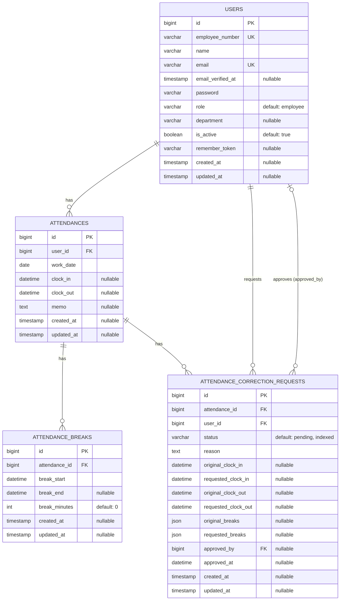

# 勤怠管理アプリ

**Attendance Management System**

Laravelで開発した勤怠管理システムです。

一般ユーザーによる勤怠登録から、  
管理者による修正申請承認・CSV出力までを実装しています。

スマートフォン表示にも対応しています。

---

## アプリイメージ


Welcome画面、ログイン画面、勤怠ダッシュボード、勤怠一覧、管理者ダッシュボード、修正申請一覧をまとめたプレビュー画像です。

---

## 主な機能

| 画面・機能 | 一般ユーザー | 管理者 |
| --- | :---: | :---: |
| welcome画面 | ○ | ○ |
| ログイン・新規登録 | ○ | ○ |
| 出勤・退勤 | ○ | ○ |
| 休憩開始・休憩終了 | ○ | ○ |
| 勤怠一覧 | 自分の勤怠を確認 | 全スタッフの勤怠を確認 |
| 勤怠詳細 | 自分の勤怠を確認 | スタッフごとの勤怠を確認 |
| 勤怠編集 | 修正申請として送信 | 直接編集可能 |
| 修正申請一覧・詳細 | 自分の申請を確認 | 全スタッフの申請を確認 |
| 修正申請承認 | − | ○ |
| スタッフ一覧 | − | ○ |
| 管理者ダッシュボード | − | ○ |
| CSV出力 | − | ○ |

## 使用技術

| 分類 | 技術 |
| --- | --- |
| バックエンド | Laravel / PHP |
| データベース | MySQL |
| テンプレート | Blade |
| スタイリング | Tailwind CSS |
| フロントエンドビルド | Vite / Node.js / npm |
| パッケージ管理 | Composer |

## 画面一覧

- welcome画面
- ログイン画面
- 新規登録画面
- 勤怠一覧画面
- 勤怠詳細画面
- 勤怠修正申請画面
- 修正申請一覧・詳細画面
- 管理者ダッシュボード
- スタッフ一覧画面
- 管理者用勤怠一覧・詳細・編集画面
- 管理者用修正申請一覧・承認画面

# 画面イメージ

## Welcome画面


アプリのトップページです。  
ログイン・新規登録への導線とアプリ概要を表示します。

---

## ログイン画面（PC）


PC向けログイン画面です。

---

## ログイン画面（スマートフォン）


レスポンシブ対応したログイン画面です。

---

## 一般ユーザーダッシュボード


出勤・退勤・休憩開始・休憩終了を行う画面です。

---

## 勤怠一覧


月ごとの勤怠情報を一覧表示します。

---

## 勤怠詳細・修正申請


勤務時間・休憩時間を確認し、修正申請を送信できます。

---

## 管理者ダッシュボード


管理者専用のメニュー画面です。

---

## 修正申請承認画面


一般ユーザーから送信された修正申請を確認・承認できます。

---

## ER図



### テーブル説明

- `users`：一般ユーザー・管理者のアカウント情報、社員番号、所属部署、利用状態を管理します。
- `attendances`：ユーザーごとの勤務日、出勤時刻、退勤時刻を日単位で管理します。
- `attendance_breaks`：勤怠に紐づく複数回の休憩開始・終了時刻と休憩時間を管理します。
- `attendance_correction_requests`：勤怠の修正前・修正後の内容、申請理由、承認状態、承認者を管理します。

### 勤怠修正申請の流れ

1. 一般ユーザーが自分の勤怠に対する修正を申請します。
2. 申請内容を `attendance_correction_requests` に `pending` 状態で保存します。この時点では元の勤怠データを変更しません。
3. 管理者が申請内容を確認して承認します。
4. 承認された出退勤時刻と複数休憩を `attendances` および `attendance_breaks` に反映します。
5. 申請状態を `approved` に更新し、承認者と承認日時を記録します。

## セットアップ

### 1. リポジトリをクローン

```bash
git clone <repository-url>
cd attendance-management
```

### 2. PHP依存パッケージをインストール

```bash
composer install
```

### 3. フロントエンド依存パッケージをインストール

```bash
npm install
```

### 4. 環境設定ファイルを作成

```bash
cp .env.example .env
```

`.env`のデータベース接続情報を、使用するMySQL環境に合わせて設定してください。

### 5. アプリケーションキーを生成

```bash
php artisan key:generate
```

### 6. データベースを作成

```bash
php artisan migrate
```

### 7. フロントエンドをビルド

```bash
npm run build
```

### 8. 開発サーバーを起動

```bash
php artisan serve
```

起動後、ブラウザから `http://127.0.0.1:8000` にアクセスしてください。

## テスト

以下のコマンドでテストを実行できます。

```bash
php artisan test
```

## ディレクトリ構成

```text
attendance-management/
├── app/          # Controller、Model、Middleware、Actionなど
├── database/     # Migration、Factory、Seeder
├── public/       # 公開ファイルとビルド済みアセット
├── resources/    # Blade、CSS、JavaScript
├── routes/       # Webルートなどのルーティング定義
└── tests/        # Featureテスト、Unitテスト
```

## 特徴・工夫した点

- 1件の勤怠に対する複数回の休憩登録・編集に対応
- 一般ユーザーの修正申請から管理者承認までのワークフローを実装
- 対象月の勤怠データをUTF-8 BOM付きCSVとして出力
- PCとスマートフォンの両方で操作しやすいレスポンシブデザイン
- Middlewareと所有者確認による管理者・一般ユーザーの権限制御

## 今後追加予定

- 夜勤・日付をまたぐ勤務への対応
- スタッフや勤怠情報の検索
- 一覧画面のページネーション
- 修正申請の却下
- 承認コメント
- メール通知

## ライセンス

MIT License

## 作者

- GitHub: https://github.com/shomaichida
