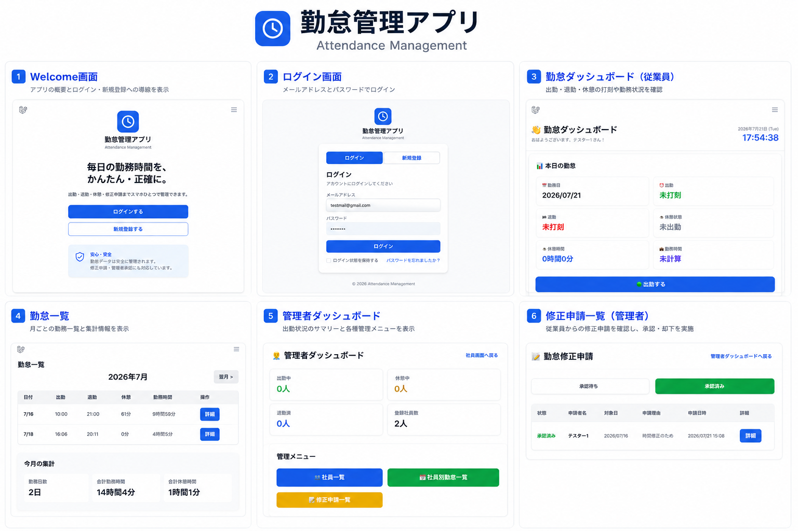
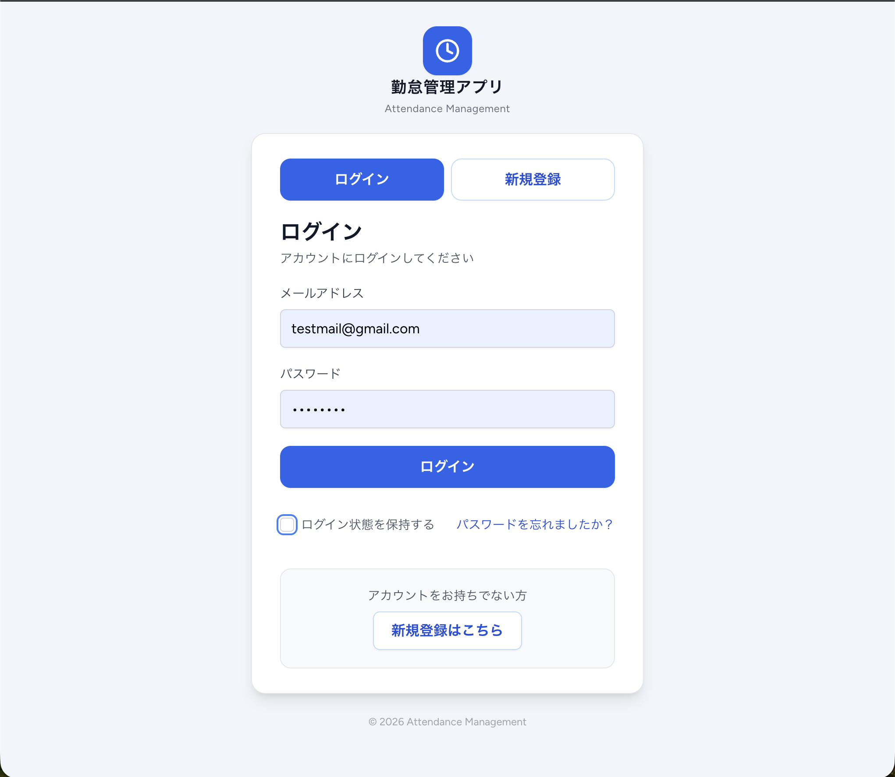
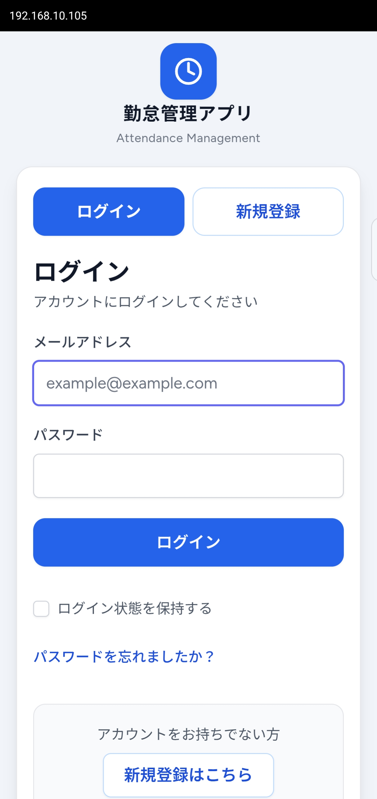
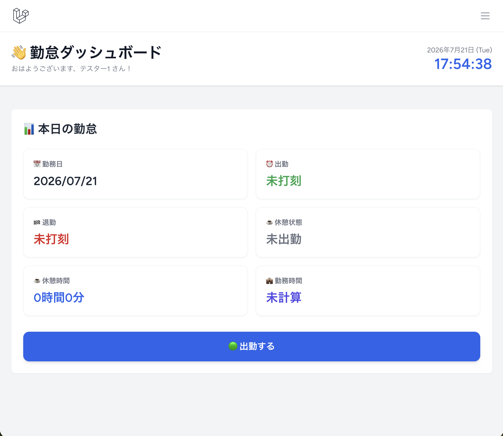
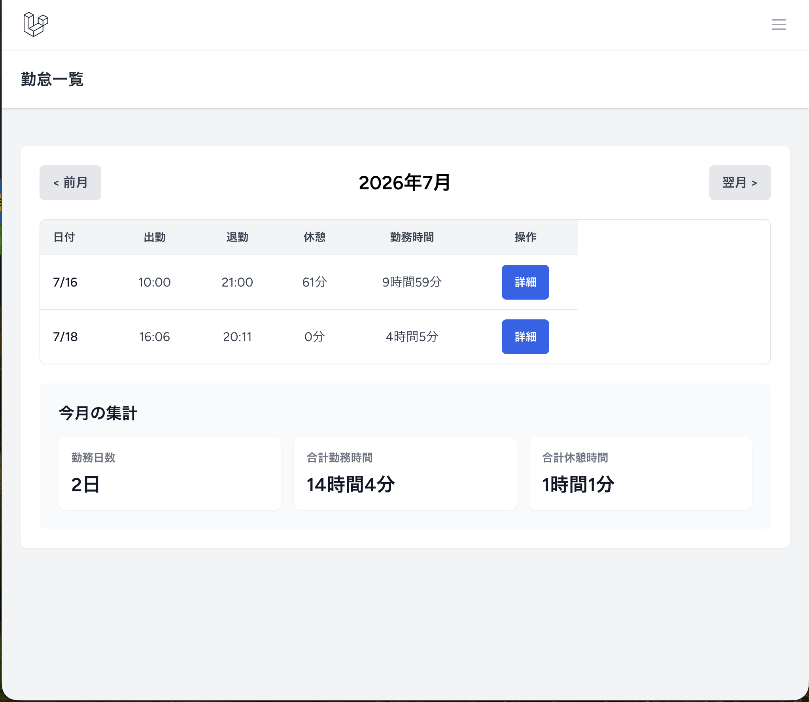
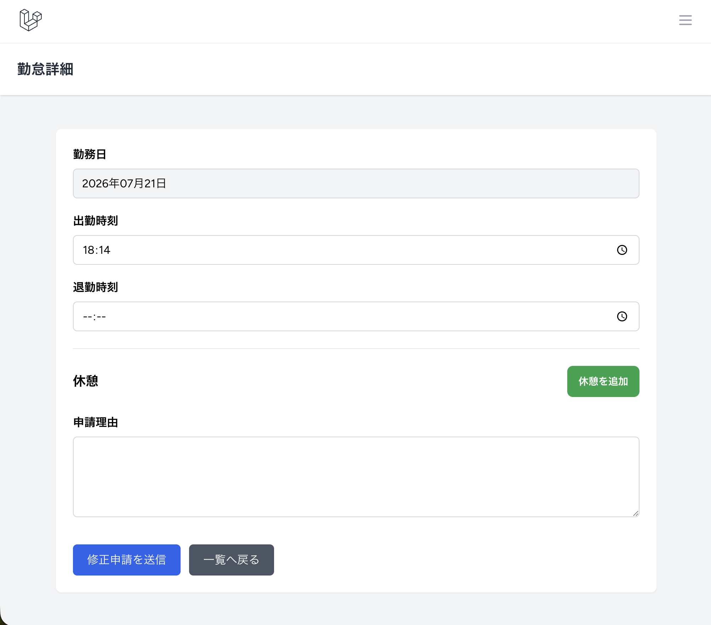
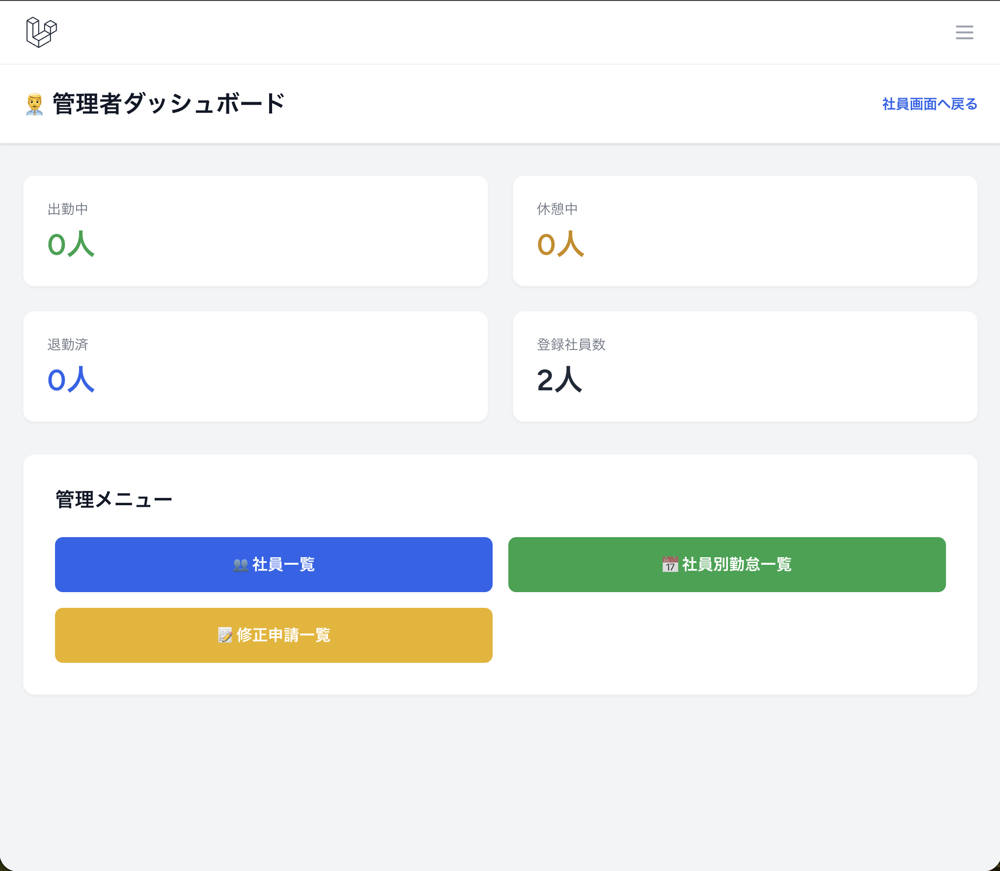
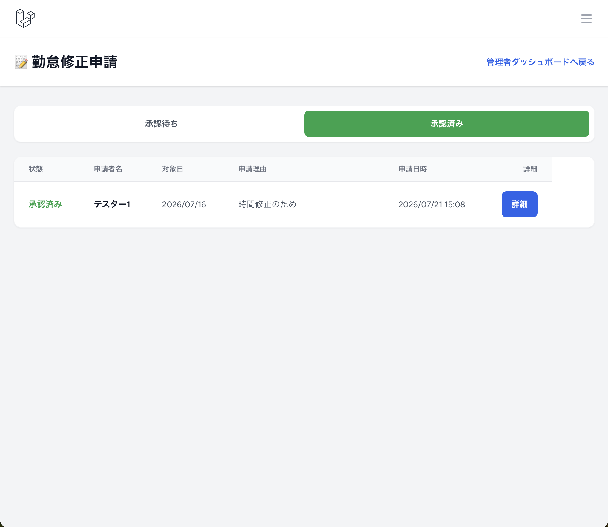
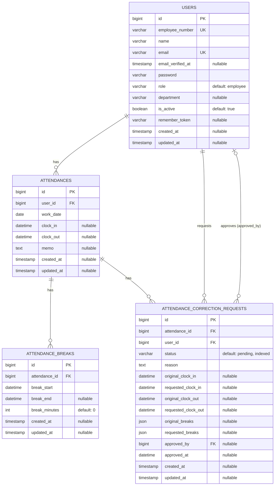

# 勤怠管理アプリ

**Attendance Management System**


## 目次

- [開発目的](#開発目的)
- [アプリ概要](#アプリ概要)
- [デモ](#デモ)
- [テストアカウント](#テストアカウント)
- [デモで確認できること](#デモで確認できること)
- [主な機能](#主な機能)
- [工夫したポイント](#工夫したポイント)
- [苦労した点](#苦労した点)
- [開発で特に力を入れた点](#開発で特に力を入れた点)
- [使用技術](#使用技術)
- [システム構成](#システム構成)
- [画面イメージ](#画面イメージ)
- [ER図](#er図)
- [開発期間](#開発期間)
- [今後の改善予定](#今後の改善予定)
- [セットアップ方法](#セットアップ方法)
- [作者](#作者)

## 開発目的

Laravelを用いたWebアプリケーション開発の学習成果として、実務を意識した勤怠管理システムを開発しました。

勤怠管理業務の効率化を目的とし、一般ユーザーと管理者で利用できる機能を分離しています。

勤怠登録から修正申請、管理者による承認、CSV出力までを一貫して行えるシステムを目指しました。

また、PCだけでなくスマートフォンからも快適に利用できるよう、レスポンシブデザインを採用しています。

## アプリ概要

Laravelを用いて開発した勤怠管理システムです。

一般ユーザーは出退勤・休憩打刻、勤怠履歴の確認、修正申請を行えます。

管理者は社員情報の確認、勤怠修正、修正申請の承認、CSV出力など、勤怠管理業務全体を行えます。

本番環境にはRenderを利用し、PC・スマートフォンの両方から利用できます。

## デモ

### 公開URL

https://attendance-management-z6i9.onrender.com

> **※ Render無料プランを利用しているため、初回アクセス時は30〜60秒ほど起動に時間がかかる場合があります。**

## テストアカウント

### 一般ユーザー

| 項目 | 内容 |
| --- | --- |
| メールアドレス | `test-device@example.com` |
| パスワード | `Test1234!` |

### 管理者

| 項目 | 内容 |
| --- | --- |
| メールアドレス | `kanrisha@example.com` |
| パスワード | `Admin123456` |

> ※ テスト用アカウントです。動作確認のため自由に操作できます。

## デモで確認できること

### 一般ユーザー

- ログイン
- 出勤・退勤打刻
- 複数回の休憩打刻
- 勤怠履歴の確認
- 勤怠修正申請

### 管理者

- 全スタッフの勤怠確認
- 勤怠編集
- 修正申請の承認
- CSV出力
- スタッフ一覧の確認

## 主な機能

| 画面・機能 | 一般ユーザー | 管理者 |
| --- | :---: | :---: |
| ウェルカム画面 | ○ | ○ |
| ログイン・新規登録 | ○ | ○ |
| 出勤・退勤 | ○ | ○ |
| 休憩開始・休憩終了 | ○ | ○ |
| 勤怠一覧 | 自分の勤怠を確認 | 全スタッフの勤怠を確認 |
| 勤怠詳細 | 自分の勤怠を確認 | スタッフごとの勤怠を確認 |
| 勤怠編集 | 修正申請として送信 | 直接編集可能 |
| 修正申請一覧・詳細 | 自分の申請を確認 | 全スタッフの申請を確認 |
| 修正申請承認 | − | ○ |
| スタッフ一覧 | − | ○ |
| 管理者ダッシュボード | − | ○ |
| CSV出力 | − | ○ |

## 工夫したポイント

- 一般ユーザーと管理者で利用できる機能を分離し、ミドルウェアによる権限制御を実装しました。
- 出勤・退勤だけでなく、複数回の休憩開始・終了に対応し、実際の勤怠運用を意識した設計にしました。
- LaravelのForm Requestを利用し、入力内容をサーバー側で適切にバリデーションしています。
- 勤怠データをCSV形式で出力できるようにし、管理業務の効率化を図っています。
- PCだけでなくスマートフォンでも快適に利用できるよう、レスポンシブデザインを採用しました。
- Renderへデプロイし、本番環境で動作確認を実施しています。

## 苦労した点

- 一般ユーザーと管理者の権限設計を整理し、それぞれに適切な画面・機能を提供できるよう設計しました。
- 複数回の休憩時間を扱うため、データ構造や編集画面の実装を工夫しました。
- Renderへのデプロイ時には、ローカル環境と本番環境の違い（データベースや環境変数など）への対応を行いました。
- スマートフォンでも見やすく操作しやすい画面になるよう、レイアウトやUIを改善しました。

## 開発で特に力を入れた点

実務で利用される勤怠管理システムを意識し、「ユーザー権限」「複数回休憩」「修正申請フロー」の3点を重点的に設計しました。

特に修正申請機能では、申請時点では元の勤怠データを変更せず、承認後にのみ反映する仕組みを採用しています。

また、PC・スマートフォンの両方で快適に利用できるようレスポンシブ対応を実施し、本番環境（Render）へデプロイして動作確認まで行いました。

## 使用技術

| 分類 | 技術 |
| --- | --- |
| Backend | Laravel 13, PHP 8.3 |
| Frontend | Blade, Tailwind CSS |
| Database | PostgreSQL（本番：Render） / MySQL（ローカル開発） |
| Build Tool | Vite, Node.js, npm |
| Authentication | Laravel Breeze |
| Deployment | Render |
| Version Control | Git, GitHub |

## システム構成

```text
Browser（PC・スマートフォン）
              │
              ▼
      Laravel 13（Render）
              │
              ▼
      PostgreSQL（Render）
```

ローカル開発では、データベースにMySQLを使用しています。

## 画面イメージ



ウェルカム画面、ログイン画面、勤怠ダッシュボード、勤怠一覧、管理者ダッシュボード、修正申請一覧をまとめたプレビュー画像です。

### 実装画面一覧

- ウェルカム画面
- ログイン画面
- 新規登録画面
- 勤怠一覧画面
- 勤怠詳細画面
- 勤怠修正申請画面
- 修正申請一覧・詳細画面
- 管理者ダッシュボード
- スタッフ一覧画面
- 管理者用勤怠一覧・詳細・編集画面
- 管理者用修正申請一覧・承認画面

### ウェルカム画面


アプリのトップページです。  
ログイン・新規登録への導線とアプリ概要を表示します。

### ログイン画面（PC）



PC向けログイン画面です。

### ログイン画面（スマートフォン）



レスポンシブ対応したログイン画面です。

### 一般ユーザーダッシュボード



出勤・退勤・休憩開始・休憩終了を行う画面です。

### 勤怠一覧



月ごとの勤怠情報を一覧表示します。

### 勤怠詳細・修正申請



勤務時間・休憩時間を確認し、修正申請を送信できます。

### 管理者ダッシュボード



管理者専用のメニュー画面です。

### 修正申請承認画面



一般ユーザーから送信された修正申請を確認・承認できます。

## ER図



### テーブル説明

- `users`：一般ユーザー・管理者のアカウント情報、社員番号、所属部署、利用状態を管理します。
- `attendances`：ユーザーごとの勤務日、出勤時刻、退勤時刻を日単位で管理します。
- `attendance_breaks`：勤怠に紐づく複数回の休憩開始・終了時刻と休憩時間を管理します。
- `attendance_correction_requests`：勤怠の修正前・修正後の内容、申請理由、承認状態、承認者を管理します。

### 勤怠修正申請の流れ

1. 一般ユーザーが自分の勤怠に対する修正を申請します。
2. 申請内容を `attendance_correction_requests` に `pending` 状態で保存します。この時点では元の勤怠データを変更しません。
3. 管理者が申請内容を確認して承認します。
4. 承認された出退勤時刻と複数休憩を `attendances` および `attendance_breaks` に反映します。
5. 申請状態を `approved` に更新し、承認者と承認日時を記録します。

## 開発期間

2026年7月15日〜現在（継続改善中）

## 今後の改善予定

現在も継続して改善を進めており、今後は以下の機能追加・品質向上を予定しています。

- 本番環境でのパスワードリセットメール運用の整備
- メール通知機能の追加（修正申請・承認通知など）
- 部署ごとの権限管理の強化
- 勤怠データのグラフ・ダッシュボード表示
- 検索・絞り込み機能の強化
- PHPUnitを利用した自動テストの拡充
- GitHub Actionsを利用したCIの導入

## ディレクトリ構成

```text
attendance-management/
├── app/                 # Controller、Model、Middleware、Actionなど
├── bootstrap/           # Laravelの起動処理
├── config/              # アプリケーション設定
├── database/            # Migration、Factory、Seeder
├── docs/
│   └── images/          # READMEで使用するスクリーンショット
├── public/              # 公開ファイルとビルド済みアセット
├── resources/
│   ├── css/             # スタイルシート
│   ├── js/              # JavaScript
│   └── views/           # Bladeテンプレート
├── routes/              # Webルートなどのルーティング定義
├── storage/             # ログ、キャッシュ、生成ファイル
├── tests/               # Featureテスト、Unitテスト
├── Dockerfile           # Render向けDocker設定
├── render.yaml          # Renderのデプロイ設定
└── README.md
```

## セットアップ方法

### 1. リポジトリをクローン

```bash
git clone <repository-url>
cd attendance-management
```

### 2. PHP依存パッケージをインストール

```bash
composer install
```

### 3. フロントエンド依存パッケージをインストール

```bash
npm install
```

### 4. 環境設定ファイルを作成

```bash
cp .env.example .env
```

`.env`のデータベース接続情報を、使用するMySQL環境に合わせて設定してください。

### 5. アプリケーションキーを生成

```bash
php artisan key:generate
```

### 6. データベースを作成

```bash
php artisan migrate
```

### 7. フロントエンドをビルド

```bash
npm run build
```

### 8. 開発サーバーを起動

```bash
php artisan serve
```

起動後、ブラウザから `http://127.0.0.1:8000` にアクセスしてください。

## テスト

以下のコマンドでテストを実行できます。

```bash
php artisan test
```

## ライセンス

MIT License

## 作者

- GitHub: https://github.com/shomaichida
